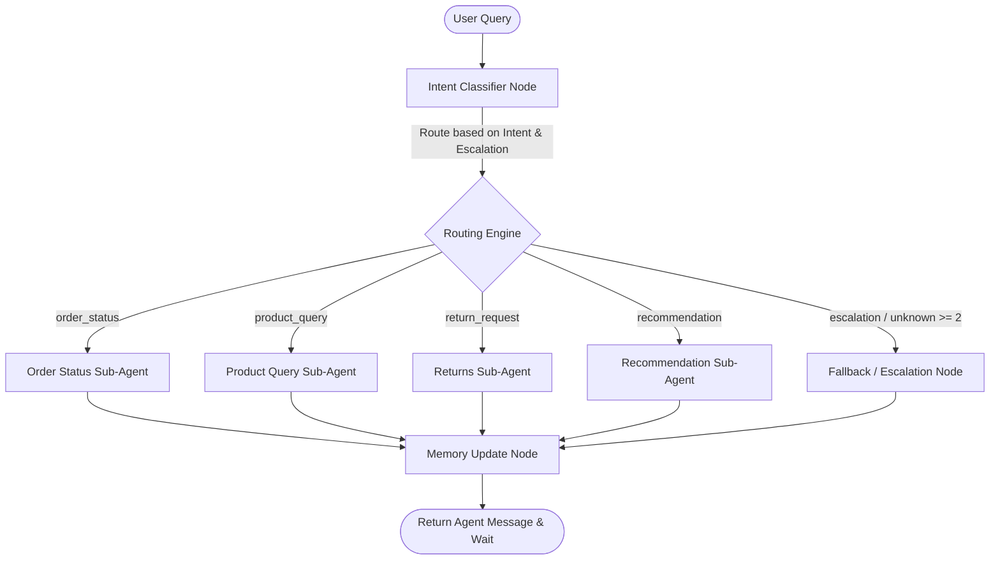

# E-Commerce Query Chatbot with LangChain and LangGraph

An intelligent customer support chatbot built using **LangGraph**, **LangChain**, **SQLite**, and **Groq LLM** (`llama-3.1-8b-instant`). The system utilizes a multi-agent orchestration architecture to classify customer requests and route them to specialized sub-agents with shared memory, automated escalation logic, LangSmith tracing, and local evaluation.

---

## 🏗️ Architecture Overview

The system runs on a state-based workflow defined by a LangGraph directed graph:



---

## 📋 Core Requirements & Implementation Mapping

Below is the detailed verification mapping showing how the chatbot meets all **11 Core Requirements**:

### 1. Database Initialization
* **Implementation File**: [seed_db.py](file:///d:/E-Commerce%20Query%20Chatbot%20with%20LangChain%20and%20LangGraph/seed_db.py)
* **Description**: Sets up an SQLite database `ecommerce.db` with tables for `customers`, `products`, `orders`, and `returns`.
* **Key Mechanisms**:
  * Uses SQLAlchemy declarative models to define tables and relationships.
  * Uses fixed random seeds (`Faker.seed(42)` and `random.seed(42)`) for reproducible database generation.
  * Guarantees at least 5 products have 0 stock, at least 10 customers have multiple orders, and referential integrity is maintained by linking returns exclusively to delivered orders.

### 2. Intent Classifier Node
* **Implementation File**: [classifier.py](file:///d:/E-Commerce%20Query%20Chatbot%20with%20LangChain%20and%20LangGraph/agent/nodes/classifier.py)
* **Description**: Classifies user input into `order_status`, `product_query`, `return_request`, `recommendation`, or `unknown`.
* **Escalation Trigger**: Tracked via `unresolved_count` and `unknown_turns`. If the same intent is unresolved for **3 consecutive turns**, or if the intent is classified as `unknown` for **2+ consecutive turns**, `escalation_flag` is set to `True` and routes to the **Fallback Node**.

### 3. Order Status Sub-Agent
* **Prompt Template**: [order_status.txt](file:///d:/E-Commerce%20Query%20Chatbot%20with%20LangChain%20and%20LangGraph/prompts/order_status.txt)
* **Execution Logic**: Configured via the `run_sub_agent` function inside [utils.py](file:///d:/E-Commerce%20Query%20Chatbot%20with%20LangChain%20and%20LangGraph/agent/nodes/utils.py).
* **Behavior Matrix**:
  * **Single Shipped Order**: Returns tracking number and estimated delivery date.
  * **Single Processing Order**: Returns estimated delivery date.
  * **Multiple Active Orders**: Lists all matching orders with their product name and asks the user for clarification.
  * **Order Not Found**: Asks the user to confirm the order ID.
  * **Order Cancelled**: Confirms cancellation and details refund status.

### 4. Product Query Sub-Agent
* **Prompt Template**: [product_query.txt](file:///d:/E-Commerce%20Query%20Chatbot%20with%20LangChain%20and%20LangGraph/prompts/product_query.txt)
* **Behavior Matrix**:
  * **In Stock**: Returns price, rating, and stock count.
  * **Out of Stock**: States the product is out of stock and suggests alternatives from the same category.
  * **Product Not Found**: Runs fuzzy matching (`LIKE` SQL query) and suggests similar products.
  * **Multiple Matches**: Lists matching options and asks the user to clarify.

### 5. Returns Sub-Agent
* **Prompt Template**: [returns.txt](file:///d:/E-Commerce%20Query%20Chatbot%20with%20LangChain%20and%20LangGraph/prompts/returns.txt)
* **Behavior Matrix**:
  * **Return Approved**: Confirms refund amount and processing timeline (3–5 business days).
  * **Return Pending**: Provides the current review status.
  * **No Return (Eligible)**: If order was delivered within the last 30 days, initiates a return flow.
  * **No Return (Ineligible)**: Explains why the order is ineligible for return (delivered >30 days ago or not shipped yet).

### 6. Recommendation Sub-Agent
* **Prompt Template**: [recommendation.txt](file:///d:/E-Commerce%20Query%20Chatbot%20with%20LangChain%20and%20LangGraph/prompts/recommendation.txt)
* **Behavior Matrix**:
  * **Has Order History**: Recommends items from categories the customer has *never* purchased from to encourage discovery.
  * **No Order History**: Recommends top-rated products across the store.
  * **Budget Filter**: Restricts recommendations to a specific price range.
  * **Category Filter**: Filters by category and ranks recommendations by rating.

### 7. Fallback / Escalation Node
* **Implementation File**: [fallback.py](file:///d:/E-Commerce%20Query%20Chatbot%20with%20LangChain%20and%20LangGraph/agent/nodes/fallback.py)
* **Description**: Intercepts unresolvable queries or multiple unknown turns.
* **Key Tasks**:
  * Responds with a polite handoff message directing the user to a human agent.
  * Prints a formatted `ESCALATION LOG` to console/logs depicting Customer ID, classified Intent, total Turn Count, and a dump of conversation history.
  * Tags the LangSmith run tree with `escalated: true`.

### 8. Conversational Context & Memory
* **Implementation File**: [memory.py](file:///d:/E-Commerce%20Query%20Chatbot%20with%20LangChain%20and%20LangGraph/agent/nodes/memory.py)
* **Description**: Extracts context from agent answers to build the `follow_up_context` state.
* **Key Logic**:
  * When a sub-agent successfully resolves a query (`is_unresolved=False`), a structured extraction model (`ContextExtraction` using Pydantic) extracts concrete `order_id`, `product_id`, and `return_id` from the response.
  * If the sub-agent asks for clarification (`is_unresolved=True`), specific IDs are *not* stored (to avoid ambiguous context), but the clarification question is saved in `follow_up_context["clarification_question"]` so that the next user response can be resolved against it.

### 9. LangSmith Tracing & Metadata
* **Description**: Tracks node execution inside LangGraph.
* **Execution Mapping**:
  * Every LangGraph node invocation acts as a child span of the state execution.
  * System tags traces in `classifier.py` and graph configurations with metadata: `intent`, `customer_id`, and `environment`.

### 10. LangSmith Hub Prompt Management
* **Implementation File**: [push_prompts.py](file:///d:/E-Commerce%20Query%20Chatbot%20with%20LangChain%20and%20LangGraph/prompts/push_prompts.py) and [utils.py](file:///d:/E-Commerce%20Query%20Chatbot%20with%20LangChain%20and%20LangGraph/agent/nodes/utils.py)
* **Description**: Prompts are separated from codebase files and managed in the `prompts/` directory.
* **Fallback Design**: The `pull_prompt_with_fallback` function attempts to pull templates from the LangSmith Hub using the `LANGSMITH_HUB_HANDLE` key, falling back automatically to local text files under the `prompts/` folder if offline.

### 11. Evaluation Suite
* **Implementation Files**: [dataset.json](file:///d:/E-Commerce%20Query%20Chatbot%20with%20LangChain%20and%20LangGraph/evals/dataset.json) and [evaluate.py](file:///d:/E-Commerce%20Query%20Chatbot%20with%20LangChain%20and%20LangGraph/evals/evaluate.py)
* **Description**: Contains a dataset of 25 query/intent classification pairs.
* **Evaluation Script**: Runs the dataset through the intent classifier node and evaluates correctness using a custom `exact_match_evaluator` function, exporting experimental results directly to LangSmith.

---

## 🚀 Getting Started

### 📦 Installation

1. Set up a Python Virtual Environment:
   ```powershell
   python -m venv venv
   venv\Scripts\activate
   ```

2. Install Dependencies:
   ```powershell
   pip install -r requirements.txt
   ```

3. Configure environment variables in a `.env` file at the root:
   ```env
   GROQ_API_KEY=your_groq_api_key
   LANGCHAIN_TRACING_V2=true
   LANGCHAIN_ENDPOINT=https://api.smith.langchain.com
   LANGCHAIN_API_KEY=your_langchain_api_key
   LANGCHAIN_PROJECT=E-Commerce Chatbot
   LANGSMITH_HUB_HANDLE=your_langsmith_handle
   ```

---

## ⚙️ Running the Chatbot and Tests

### 🗄️ 1. Seed the Database
Run the seed script to create and populate `ecommerce.db`:
```powershell
python seed_db.py
```

### 💬 2. Start Chatting
Launch the CLI interface to interact with the chatbot:
```powershell
python main.py
```

### 🧪 3. Run Verification Suite
Runs the built-in system verification scripts for local database checks, multi-turn conversational flows, context-based return routing, unknown intent handling, and unresolved same-intent escalation:
```powershell
python verify_chatbot.py
```

### 📈 4. Run LangSmith Evals
Execute the intent classification evaluation suite:
```powershell
python evals/evaluate.py
```
